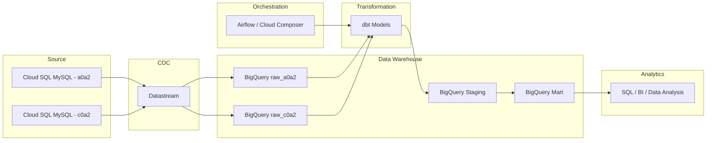

# Aurora Data Platform Demo

## Overview

This project demonstrates a production-style data platform architecture built on Google Cloud Platform (GCP).

The goal is to simulate a real-world analytics pipeline similar to the printer business workflow previously implemented on AWS.

Original pipeline (legacy architecture):

RDS (MySQL) → AWS Glue → RDS (MySQL)

This project rebuilds the pipeline using a modern data stack:

Cloud SQL (MySQL) → Datastream (CDC) → BigQuery → dbt → Orchestration

Operational data is ingested from a transactional database and transformed into analytics-ready datasets using a layered data warehouse design.

A key design goal of this project is to simulate **multi-subsidiary data environments**, where multiple companies share the same data structure but maintain separate operational schemas.

Each subsidiary stores its data in a **separate schema**, while the analytics transformations are executed using **a single dbt project and shared transformation logic**.

In the initial phase, existing business SQL logic was migrated directly into dbt models to reproduce key business datamarts quickly and accurately.

Future iterations may further refactor the transformation layer into staging and intermediate models for improved modularity and reuse.

---

# Architecture

The platform follows a modern data architecture:

Cloud SQL (MySQL)
↓
Datastream (CDC Replication)
↓
BigQuery Raw Layer
↓
dbt Transformations
↓
BigQuery Analytics Layer
↓
SQL / BI Analysis

The system separates operational storage from analytical workloads, enabling scalable and maintainable data modeling.

The architecture also supports **multiple subsidiaries**, where operational data from different schemas is replicated into separate raw datasets in BigQuery.

These datasets share the same schema structure but represent different companies.

All subsidiaries are processed using **the same dbt transformation framework**, demonstrating how a centralized analytics platform can support multiple operational tenants.

---

# Multi-Subsidiary Data Design

In many real-world enterprise systems, multiple subsidiaries operate independent transactional databases but follow similar schemas.

This project simulates that scenario.

Example operational schemas:

Cloud SQL

a0a2 schema  
c0a2 schema  

Each schema represents a different subsidiary.

Datastream replicates these schemas into **separate raw datasets in BigQuery**:

BigQuery

raw_a0a2  
raw_c0a2  

Although the data is stored in separate schemas, the table structures are identical.

This allows the analytics layer to reuse **a single set of dbt models** to process data across multiple subsidiaries.

This design demonstrates how a centralized data platform can support multi-tenant operational systems while maintaining reusable transformation logic.

---

# Data Source

The operational database is hosted on Cloud SQL (MySQL).

Example tables include:

- ct010dl_new
- ct020dl_new
- ct020bv2dl_new
- eq010dl_new
- sd022dl_new
- sd023dl_new
- mm000dl_new
- CONSUMP_DETAIL

These tables represent operational events such as invoices and their related consumables.

Each subsidiary maintains its own schema containing these tables.

---

# Data Ingestion

Operational data is ingested from Cloud SQL into BigQuery using Google Cloud Datastream, which enables Change Data Capture (CDC) replication.

Datastream continuously captures database changes from the MySQL binlog and replicates them into BigQuery.

Each operational schema is replicated into a **separate dataset in BigQuery**, preserving isolation between subsidiaries.

Example mapping:

Cloud SQL schema → BigQuery dataset

a0a2 → raw_a0a2  
c0a2 → raw_c0a2  

This approach reflects production best practices where operational databases are replicated into analytics warehouses using CDC pipelines.

---

# Data Warehouse Layers

The BigQuery warehouse follows a layered data modeling approach.

## Raw Layer

Replicated source tables from Cloud SQL via Datastream.

Each subsidiary has its own dataset:

raw_a0a2  
raw_c0a2  

These datasets contain replicated operational tables.

Examples:

- ct010dl_new
- ct020dl_new
- eq010dl_new

---

## Staging Layer

Built using dbt.

Responsibilities:

- standardizing column names
- cleaning inconsistent data
- deriving intermediate fields

The staging models normalize raw data into consistent analytical structures.

---

## Mart Layer

Business-level models used for analytics.

Example outputs:

- device_print_volume
- toner_usage_summary
- device_utilization_metrics

The same mart models are executed for each subsidiary dataset.

---

# Transformation Layer

All transformations are implemented using dbt.

dbt is responsible for:

- defining sources from raw tables
- building staging models
- building mart models
- managing SQL lineage and dependency DAG

Example transformation flow:

raw → staging → mart

A single dbt project is used to process data across multiple subsidiaries.

Schema parameters allow the same SQL models to run against different datasets, ensuring reusable transformation logic.

---

# Orchestration

Pipeline orchestration is designed to support production workflows.

Two orchestration approaches are considered:

- Cloud Composer (Airflow)
- Cloud Run scheduled jobs

Example workflow:

Datastream replication  
↓  
dbt run / dbt build  

---

# Technology Stack

| Layer | Technology |
|------|-------------|
| Source Database | Cloud SQL (MySQL) |
| CDC Replication | Datastream |
| Data Warehouse | BigQuery |
| Transformation | dbt |
| Orchestration | Cloud Composer / Airflow |
| Compute | Cloud Run |
| Language | SQL / Python |

---

# Project Goal

This project demonstrates how a production-style analytics platform can be designed using modern cloud data tools.

Key skills demonstrated include:

- data pipeline architecture design
- CDC-based ingestion from operational databases
- multi-subsidiary data platform design
- warehouse modeling with layered architecture
- transformation with dbt
- workflow orchestration
- cloud-native data platform design

---

# Sample Data

The sample data used in this project is derived from production-like schemas but has been anonymized and modified for demonstration purposes.

No personally identifiable information (PII) or sensitive business information is included.

---

# Project Structure

aurora-data-platform-demo
├── dbt
├── sql
├── architecture
└── README.md

---

# Architecture Diagram

