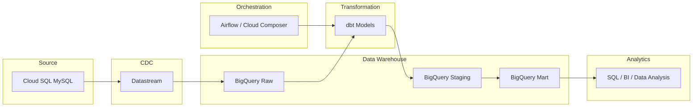

# Aurora Data Platform Demo

## Overview

This project demonstrates a production-style data platform architecture built on Google Cloud Platform (GCP).

The goal is to simulate a real-world analytics pipeline similar to the printer business workflow previously implemented on AWS.

Original pipeline (legacy architecture):

MySQL → AWS Glue → MySQL

This project rebuilds the pipeline using a modern data stack:

Cloud SQL (MySQL) → Datastream (CDC) → BigQuery → dbt → Orchestration

Operational data is ingested from a transactional database and transformed into analytics-ready datasets using a layered data warehouse design.

---

## Architecture

The platform follows a modern data architecture:

Cloud SQL (MySQL)
↓
Datastream (CDC Replication)
↓
BigQuery Raw Layer
↓
dbt Transformations
↓
BigQuery Analytics Layer
↓
SQL / BI Analysis

The system separates operational storage from analytical workloads, enabling scalable and maintainable data modeling.

---

## Data Source

The operational database is hosted on Cloud SQL (MySQL).

Example tables include:

- ct010dl_new
- ct020dl_new
- ct020bv2dl_new
- eq010dl_new
- sd022dl_new
- sd023dl_new
- mm000dl_new
- CONSUMP_DETAIL

These tables represent operational events such as invoices and their related consumables.

---

## Data Ingestion

Operational data is ingested from Cloud SQL into BigQuery using Google Cloud Datastream, which enables Change Data Capture (CDC) replication.

Datastream continuously captures database changes from the MySQL binlog and replicates them into BigQuery.

This approach reflects production best practices where operational databases are replicated into analytics warehouses using CDC pipelines.

---

## Data Warehouse Layers

The BigQuery warehouse follows a layered data modeling approach.

### Raw Layer

Replicated source tables from Cloud SQL via Datastream.

Examples:

- raw_equipment
- raw_print_detail
- raw_toner_detail

### Staging Layer

Built using dbt.

Responsibilities:

- standardizing column names
- cleaning inconsistent data
- deriving intermediate fields

### Mart Layer

Business-level models used for analytics.

Example outputs:

- device_print_volume
- toner_usage_summary
- device_utilization_metrics

---

## Transformation Layer

All transformations are implemented using dbt.

dbt is responsible for:

- defining sources from raw tables
- building staging models
- building mart models
- managing SQL lineage and dependency DAG

Example transformation flow:

raw → staging → mart

---

## Orchestration

Pipeline orchestration is designed to support production workflows.

Two orchestration approaches are considered:

- Cloud Composer (Airflow)
- Cloud Run scheduled jobs

Example workflow:

Datastream replication
↓
dbt run / dbt build

---

## Technology Stack

Layer | Technology
------|-------------
Source Database | Cloud SQL (MySQL)
CDC Replication | Datastream
Data Warehouse | BigQuery
Transformation | dbt
Orchestration | Cloud Composer / Airflow
Compute | Cloud Run
Language | SQL / Python

---

## Project Goal

This project demonstrates how a production-style analytics platform can be designed using modern cloud data tools.

Key skills demonstrated include:

- data pipeline architecture design
- CDC-based ingestion from operational databases
- warehouse modeling with layered architecture
- transformation with dbt
- workflow orchestration
- cloud-native data platform design

---

## Sample Data

The sample data used in this project is derived from production-like schemas but has been anonymized and modified for demonstration purposes.

No personally identifiable information (PII) or sensitive business information is included.

---

## Project Structure

aurora-data-platform-demo

├── ingestion
├── dbt
├── sql
├── architecture
└── README.md

---

## Architecture Diagram

