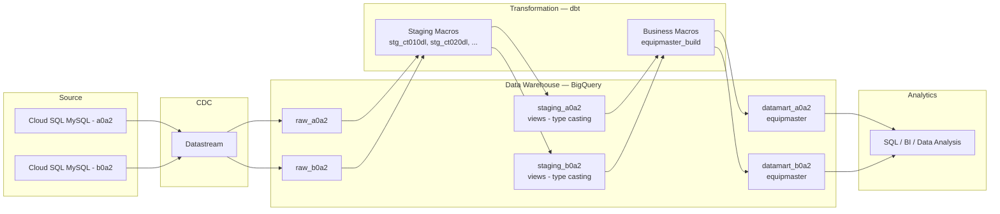

# Aurora Data Platform Demo

## Overview

This project demonstrates a production-style data platform architecture built on Google Cloud Platform (GCP).

The goal is to simulate a real-world analytics pipeline similar to the printer business workflow previously implemented on AWS.

Original pipeline (legacy architecture):

RDS (MySQL) → AWS Glue → RDS (MySQL)

This project rebuilds the pipeline using a modern data stack:

Cloud SQL (MySQL) → Datastream (CDC) → BigQuery → dbt → Orchestration

Operational data is ingested from a transactional database and transformed into analytics-ready datasets using a layered data warehouse design.

A key design goal of this project is to simulate **multi-subsidiary data environments**, where multiple companies share the same data structure but maintain separate operational schemas.

Each subsidiary stores its data in a **separate schema**, while the analytics transformations are executed using **a single dbt project with shared macro-based transformation logic**.

Business SQL logic was migrated from MySQL into dbt macros, enabling reuse across subsidiaries. The transformation layer follows a **three-layer architecture** (source → staging → datamart), where:

- **Staging layer** handles data type normalization (e.g., Datastream type mismatches between MySQL and BigQuery)
- **Datamart layer** contains the business logic, referencing staging views via `ref()`

---

# Architecture

The platform follows a modern data architecture:

Cloud SQL (MySQL)
↓
Datastream (CDC Replication)
↓
BigQuery Raw Layer (raw_a0a2, raw_b0a2)
↓
dbt Staging Layer — views for type casting & normalization
↓
dbt Datamart Layer — incremental tables with business logic
↓
SQL / BI Analysis

The system separates operational storage from analytical workloads, enabling scalable and maintainable data modeling.

The architecture supports **multiple subsidiaries**, where operational data from different schemas is replicated into separate raw datasets in BigQuery.

All subsidiaries are processed using **the same dbt macro framework**, with company-specific model files that pass parameters to shared macros.

---

# Multi-Subsidiary Data Design

In many real-world enterprise systems, multiple subsidiaries operate independent transactional databases but follow similar schemas.

This project simulates that scenario.

Example operational schemas:

Cloud SQL

a0a2 schema
b0a2 schema

Each schema represents a different subsidiary.

Datastream replicates these schemas into **separate raw datasets in BigQuery**:

BigQuery

raw_a0a2
raw_b0a2

Although the data is stored in separate schemas, the table structures are identical.

The dbt project uses a **macro + folder** pattern to handle multi-subsidiary processing:

- **Shared macros** (`equipmaster_build`, `stg_ct010dl`, etc.) contain the actual SQL logic with a `source_name` or `company` parameter
- **Company-specific model files** (e.g., `equipmaster_a0a2.sql`) call the macro with the appropriate company code
- Each company's models output to **separate target schemas** (e.g., `datamart_a0a2`, `datamart_b0a2`)

This design enables a centralized data platform to support multi-tenant operational systems while maintaining reusable transformation logic.

---

# Data Source

The operational database is hosted on Cloud SQL (MySQL).

Source tables include:

| Table | Description |
|-------|-------------|
| ct010dl_new | Contract Header |
| ct020dl_new | Contract Detail |
| ct020bv2dl_new | Contract Equipment Status |
| eq010dl_new | Equipment Master |
| sd022dl_new | Sales Contract |
| sd023dl_new | Sales Contract Detail |
| mm000dl_new | Material Master |
| CONSUMP_DETAIL | Consumable Detail |

Each subsidiary maintains its own schema containing these tables.

---

# Data Ingestion

Operational data is ingested from Cloud SQL into BigQuery using Google Cloud Datastream, which enables Change Data Capture (CDC) replication.

Datastream continuously captures database changes from the MySQL binlog and replicates them into BigQuery.

Each operational schema is replicated into a **separate dataset in BigQuery**, preserving isolation between subsidiaries.

Example mapping:

| Cloud SQL schema | BigQuery dataset |
|-----------------|------------------|
| a0a2 | raw_a0a2 |
| b0a2 | raw_b0a2 |

**Note:** Datastream may change column types during replication (e.g., MySQL VARCHAR → BigQuery FLOAT64/INT64). The staging layer resolves these type mismatches by explicitly casting columns to the expected analytical data types.

---

# Data Warehouse Layers

The BigQuery warehouse follows a three-layer data modeling approach.

## Raw Layer

Replicated source tables from Cloud SQL via Datastream.

Each subsidiary has its own dataset:

- raw_a0a2
- raw_b0a2

These datasets contain replicated operational tables with their original column types (which may differ from MySQL due to Datastream conversion).

---

## Staging Layer

Built using dbt, materialized as **views** (no storage cost).

Each source table has a corresponding staging model per subsidiary:

- `stg_a0a2_ct010dl`, `stg_b0a2_ct010dl`, etc.

Responsibilities:

- **Type casting**: normalizing column types (e.g., `CAST(CT020_7 AS STRING)`) to resolve Datastream type mismatches
- Providing a clean, consistently-typed interface for downstream models

Staging macros (e.g., `stg_ct010dl.sql`) define the CAST logic once, and company-specific model files call them with the appropriate source name.

Target schemas: `staging_a0a2`, `staging_b0a2`

---

## Datamart Layer

Business-level models used for analytics, materialized as **incremental tables** with clustering.

Current models:

- `equipmaster` — 合約設備主檔 (Contract Equipment Master)

Key features:

- **Incremental materialization**: DELETE + INSERT pattern using `run_query()` to handle sliding-window updates (records within 6 months)
- **Clustering**: by `MARA`, `MACNO`, `CTNO` for query performance
- **Alias**: model files are named `equipmaster_a0a2.sql` / `equipmaster_b0a2.sql` (unique names for dbt), but output tables are aliased to `equipmaster`
- **Data quality tests**: `not_null` on key columns, `unique` on composite key

Target schemas: `datamart_a0a2`, `datamart_b0a2`

---

# Transformation Layer

All transformations are implemented using dbt.

## dbt Project Structure

```
dbt/aurora_platform/
├── dbt_project.yml
├── macros/
│   ├── generate_schema_name.sql    — Custom schema naming (no prefix)
│   ├── equipmaster_build.sql       — Shared business logic macro
│   ├── stg_ct010dl.sql             — Staging macro: ct010dl
│   ├── stg_ct020dl.sql             — Staging macro: ct020dl
│   ├── stg_ct020bv2dl.sql          — Staging macro: ct020bv2dl
│   ├── stg_eq010dl.sql             — Staging macro: eq010dl
│   ├── stg_sd022dl.sql             — Staging macro: sd022dl
│   ├── stg_sd023dl.sql             — Staging macro: sd023dl
│   └── stg_mm000dl.sql             — Staging macro: mm000dl
└── models/
    ├── sources/
    │   ├── _src_a0a2.yml           — Source definition for A0A2
    │   └── _src_b0a2.yml           — Source definition for B0A2
    ├── staging/
    │   ├── a0a2/                   — 7 staging views for A0A2
    │   └── b0a2/                   — 7 staging views for B0A2
    └── datamart/
        ├── a0a2/
        │   ├── equipmaster_a0a2.sql
        │   └── _equipmaster_a0a2.yml
        └── b0a2/
            ├── equipmaster_b0a2.sql
            └── _equipmaster_b0a2.yml
```

## Key Design Patterns

**Macro-based reuse**: Business logic is written once in macros and called with company-specific parameters. This avoids SQL duplication while allowing future divergence per subsidiary.

**Dynamic ref()**: The `equipmaster_build` macro uses `ref('stg_' ~ company ~ '_ct010dl')` to dynamically reference the correct staging model based on the company parameter.

**Custom schema naming**: The `generate_schema_name` macro overrides dbt's default behavior to use the exact schema name specified (e.g., `datamart_a0a2` instead of `target_schema_datamart_a0a2`).

**Incremental with run_query()**: Instead of using `pre_hook` for DELETE operations, the model uses `run_query()` in the model body for reliable execution timing.

## Data Flow

```
source('raw_a0a2', 'ct010dl_new')    — Raw table replicated by Datastream
        ↓
ref('stg_a0a2_ct010dl')              — Staging view (type normalization)
        ↓
ref('equipmaster_a0a2')              — Datamart table (business logic)
```

---

# Orchestration

Pipeline orchestration is designed to support production workflows.

Two orchestration approaches are considered:

- Cloud Composer (Airflow)
- Cloud Run scheduled jobs

Example workflow:

Datastream replication
↓
dbt build (staging views + datamart tables + tests)

---

# Technology Stack

| Layer | Technology |
|------|-------------|
| Source Database | Cloud SQL (MySQL) |
| CDC Replication | Datastream |
| Data Warehouse | BigQuery |
| Transformation | dbt (BigQuery adapter) |
| Orchestration | Cloud Composer / Airflow |
| Compute | Cloud Run |
| Language | SQL / Jinja / Python |

---

# Project Goal

This project demonstrates how a production-style analytics platform can be designed using modern cloud data tools.

Key skills demonstrated include:

- data pipeline architecture design
- CDC-based ingestion from operational databases
- multi-subsidiary data platform design with shared transformation logic
- warehouse modeling with three-layer architecture (raw → staging → datamart)
- transformation with dbt using macro-based reuse patterns
- incremental materialization with DELETE + INSERT pattern
- data quality testing with dbt tests
- BigQuery-specific optimizations (clustering, custom schema naming)
- workflow orchestration

---

# Sample Data

The sample data used in this project is derived from production-like schemas but has been anonymized and modified for demonstration purposes.

No personally identifiable information (PII) or sensitive business information is included.

---

# Project Structure

```
aurora-data-platform-demo/
├── docs/
│   ├── 01_project_scope.md
│   ├── architecture.md
│   ├── desicion.md
│   └── ingestion.md
├── dbt/
│   └── aurora_platform/
│       ├── dbt_project.yml
│       ├── macros/
│       ├── models/
│       │   ├── sources/
│       │   ├── staging/
│       │   └── datamart/
│       └── tests/
├── orchestration/
└── README.md
```

---

# Architecture Diagram


